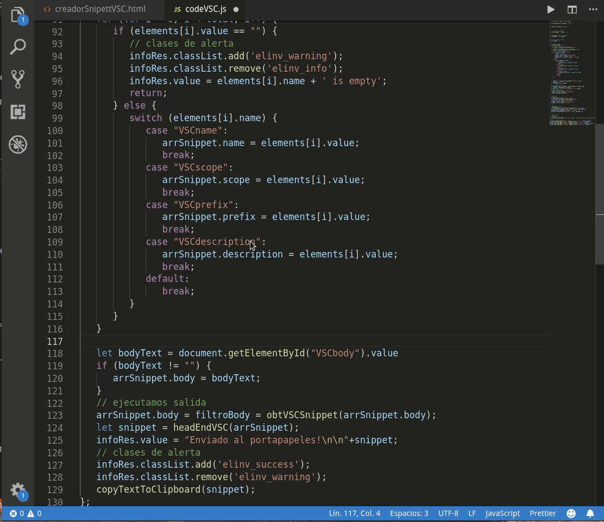

# Generador-Snippets-Elinv @ 2019
- 
	Extensión de Visual Studio Code, 
 	que facilita la creación de Fragmentos de Códigos de Usuario.
- 
# 	Generador automático de snippets Elinv
- 	English:
- 	----------------------------------------------
- 	The code to be added as snippets is selected.
- 	Press Ctrl + Alt + g
- 	or
- 	Ctrl + Shift + p and find the extension
- 	Generator of Snippets Elinv and
- 	the webview will automatically be displayed
- 	with the selected code, it is enough to fill in the fields
- 	name, scope, prefix and description.
- 	Once done, press the <Build> button and
- 	you can enter the code snippet
- 	which is on the clipboard and on view in the webview.
- 	----------------------------------------------

- 	Español:
- 	----------------------------------------------
- 	Se selecciona el código a agregar como snippets.
- 	Se presiona las teclas Ctrl + Alt + g
- 	o
- 	Ctrl + Shift + p y busca la extension
- 	Generador de Snippets Elinv y
- 	automáticamente se displayará el webview
- 	con el código seleccionado, bastando llenar los campos
- 	name, scope, prefix y descripción.
- 	Una vez hecho, se presiona el boton <Construir> y
- 	se puede ingresar el fragmento de código
- 	que se halla en el portapapeles y a la vista en el webview.
- 	----------------------------------------------

## 	Demo

